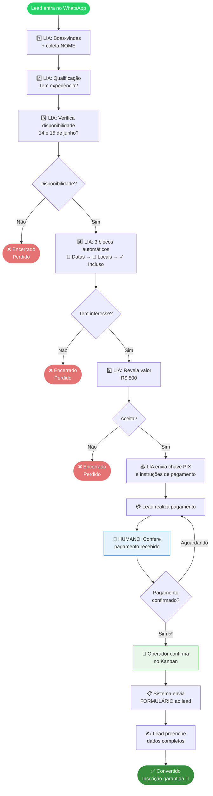

```mermaid
flowchart TD
    A([Lead entra no WhatsApp]) --> B["1️⃣ LIA: Boas-vindas\n+ coleta NOME"]
    B --> C["2️⃣ LIA: Qualificação\nTem experiência?"]
    C --> D["3️⃣ LIA: Verifica disponibilidade\n14 e 15 de junho?"]
    
    D --> D_no{Disponibilidade?}
    D_no -- Não --> END_NO([❌ Encerrado\nPerdido])
    D_no -- Sim --> E["4️⃣ LIA: 3 blocos automáticos<br/>📅 Datas → 📍 Locais → ✓ Incluso"]
    
    E --> F{Tem interesse?}
    F -- Não --> END_NO2([❌ Encerrado\nPerdido])
    F -- Sim --> G["5️⃣ LIA: Revela valor\nR$ 500"]
    
    G --> H{Aceita?}
    H -- Não --> END_NO3([❌ Encerrado\nPerdido])
    H -- Sim --> J["📤 LIA envia chave PIX\ne instruções de pagamento"]
    J --> K["💳 Lead realiza pagamento"]
    K --> L["👤 HUMANO: Confere\npagamento recebido"]
    
    L --> M{Pagamento<br/>confirmado?}
    M -- Aguardando --> K
    M -- Sim ✅ --> N["🎯 Operador confirma\nno Kanban"]
    
    N --> O["📋 Sistema envia\nFORMULÁRIO ao lead"]
    O --> P["✍️ Lead preenche\ndados completos"]
    P --> Q([✅ Convertido\nInscrição garantida 🎉])
    
    style A fill:#25d366,color:#fff,stroke:none
    style Q fill:#388e3c,color:#fff,stroke:none
    style END_NO fill:#e57373,color:#fff,stroke:none
    style END_NO2 fill:#e57373,color:#fff,stroke:none
    style END_NO3 fill:#e57373,color:#fff,stroke:none
    style L fill:#e3f2fd,stroke:#1976d2,color:#333
    style N fill:#e8f5e9,stroke:#388e3c,color:#333
```
